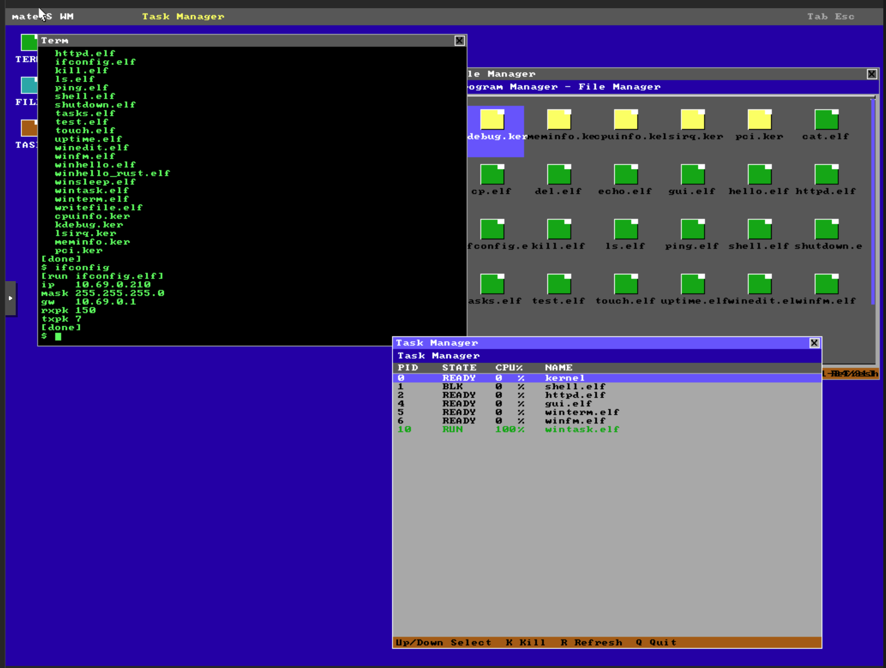
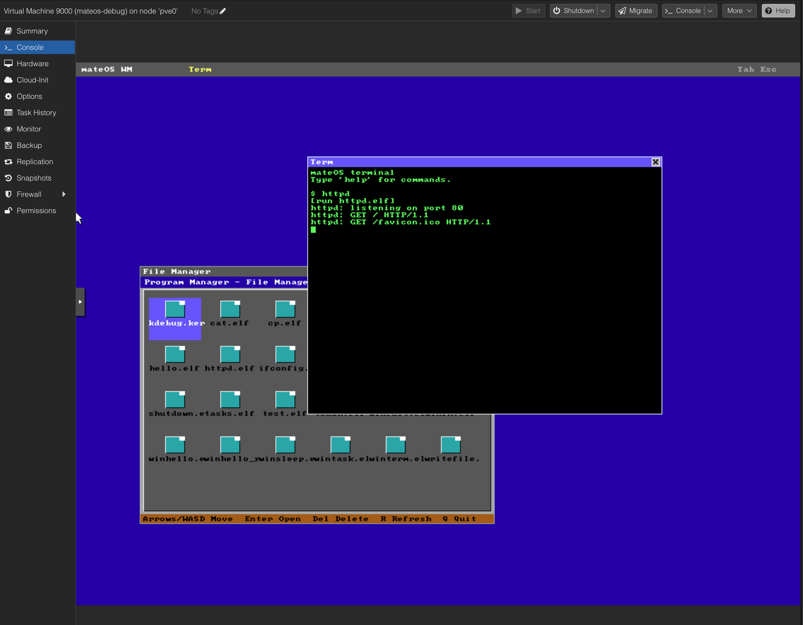

# mateOS

A minimal educational operating system for learning x86 architecture, written in C and Rust.

32-bit (i686) architecture, bootable via multiboot.

Inspired by experimenting with a simple OS on the 6502.





## Features

### Core System
- **Protected Mode** - Full 32-bit protected mode with GDT (6 segments)
- **Interrupts** - IDT with 256 entries, exception and IRQ handling via PIC
- **Paging** - Identity-mapped 32MB with per-process page directories
- **Physical Memory Manager** - Bitmap-based allocator for 4KB frames (8-32MB range, 6144 frames)
- **Heap Allocator** - Dynamic kernel allocation via liballoc (0x400000-0x600000)

### Multitasking
- **Preemptive Scheduling** - Round-robin scheduler with 100Hz PIT timer
- **Kernel Threads** - Ring 0 tasks with full kernel privileges
- **User Processes** - Ring 3 tasks with hardware memory protection
- **Context Switching** - Full CPU state save/restore including segment registers, CR3 swap
- **Per-Process Address Spaces** - Each user process gets its own page directory, isolating virtual memory at 0x700000
- **Background Jobs** - Shell supports `&` suffix to run tasks in background with `jobs` tracking

### Process Management
- **spawn + wait** - Fork-like process creation from ELF binaries
- **argc/argv** - Programs receive command-line arguments via `_start(int argc, char **argv)`
- **Non-blocking wait** - `wait_nb()` polls child status without blocking
- **Process detach** - GUI apps call `detach()` to release from parent's wait
- **Process kill** - `kill(pid)` terminates any task by PID
- **Process Isolation** - Child processes run in separate address spaces, parent memory is never touched
- **ELF Loader** - Loads ELF32 binaries from ramfs into per-process physical frames
- **Exit Codes** - Processes return exit codes to their parent via wait()

### Networking
- **RTL8139 NIC Driver** - PCI-based Ethernet driver in `src/drivers/`
- **lwIP TCP/IP Stack** - Full IPv4 networking (ARP, ICMP, TCP, UDP)
- **ICMP Ping** - `ping` command and `net_ping()` syscall
- **TCP Sockets** - Kernel socket table with listen/accept/send/recv/close syscalls
- **HTTP Server** - Userland `httpd` serves HTML on port 80
- **Network Configuration** - `ifconfig` command to set/view IP, netmask, gateway
- **DHCP via QEMU** - Automatic IP configuration with QEMU user-mode networking

### Window Manager
- **Compositing WM** - `gui` owns the framebuffer and composites child windows via backbuffer
- **Window Syscalls** - create, destroy, read, write, getkey, sendkey, list
- **Drag & Z-order** - Click title bar to drag, click to focus and raise, up to 16 windows
- **Close Button** - X button in title bar sends ESC → 'q' → kill() as graceful shutdown
- **Desktop Icons** - Clickable TERM, FILES, TASKS icons to launch apps
- **Taskbar** - Top bar showing "mateOS WM", focused window title, and keyboard hints
- **Mouse Cursor** - Custom arrow cursor with transparency mask
- **Focus Management** - Tab key cycles focus through z-order, ESC closes focused window
- **Window Terminal** - `winterm` provides a full shell with stdout redirection and 61x34 char grid
- **File Manager** - `winfm` with icon grid, color-coded file types, extension filter (F key), scrollbar
- **Task Manager** - `wintask` with CPU% tracking, process kill, auto-refresh
- **Auto-launch** - WM spawns winterm and winfm on startup

### Filesystem
- **Virtual File System (VFS)** - Abstraction layer supporting multiple filesystem backends
- **Ramfs** - In-memory filesystem loaded from multiboot initrd module
- **FAT16** - Read/write FAT16 on IDE disk with MBR partition detection, cluster allocation, file create/delete
- **Virtual OS Files** - Synthetic `.mos` files exposing runtime system info (cpuinfo, meminfo, lsirq, pci, kdebug)
- **Per-Process File Descriptors** - Each task has its own FD table (16 max)
- **File I/O Syscalls** - open, read, write, close, seek, stat, unlink
- **Initrd Tool** - `tools/mkinitrd` packs `.elf` and `.wlf` binaries into a bootable initrd image

### User Mode Support
- **TSS (Task State Segment)** - Kernel stack switching on ring transitions
- **50 Syscalls** via int 0x80:
  - **Process:** write, exit, yield, exec, spawn, wait, wait_nb, getpid, tasklist, shutdown, sleep_ms, detach, kill, getticks
  - **Graphics:** gfx_init, gfx_exit, gfx_info, getmouse
  - **Keyboard:** getkey
  - **Filesystem:** readdir, open, fread, fwrite, close, seek, stat, unlink
  - **Window Manager:** win_create, win_destroy, win_write, win_read, win_getkey, win_sendkey, win_list, win_read_text, win_set_stdout
  - **Networking:** net_ping, net_cfg, net_get, sock_listen, sock_accept, sock_send, sock_recv, sock_close, netstats
  - **System Info:** lspci, lsirq, meminfo, cpuinfo
- **Memory Isolation** - User pages marked non-supervisor, kernel pages protected
- **Separate Stacks** - Each user process has independent kernel and user stacks

### Graphics
- **Bochs VGA (BGA)** - 1024x768 with 256-color palette via Bochs dispi registers
- **VGA Mode 13h Fallback** - 320x200 with 256 colors when BGA unavailable
- **VGA Text Mode** - 80x25 character display with scrolling
- **Userland Graphics Library** - `ugfx.h` provides pixel drawing, rectangles, text rendering, buffer operations

### Other
- **Rust Integration** - Hybrid C/Rust kernel with `no_std` Rust components and userland Rust programs
- **PCI Bus Enumeration** - Scans bus 0, reads vendor/device IDs, class codes, BARs, IRQ lines
- **ATA PIO Driver** - Primary-master IDE disk access with 28-bit LBA addressing
- **Keyboard Driver** - PS/2 keyboard with scancode translation, extended scancodes (arrow keys), shift support, 256-byte ring buffer
- **Mouse Driver** - PS/2 mouse with 3-byte packet assembly, sign-extended deltas, bounds clamping
- **System Info** - cpuinfo, meminfo, lspci, lsirq, netstats syscalls + virtual .mos files
- **Userland Shell** - Interactive command-line shell running in Ring 3
- **DOOM Port** - doomgeneric DOOM engine running in a WM window (320x200, 8bpp)
- **Test Suite** - 23-test userland test suite covering syscalls, memory, process isolation, VFS, argv

## Building

```bash
make userland                # Build all userland programs
make initrd                  # Build userland + pack into initrd.img
make                         # Build kernel (dmos.bin)
make run                     # Run in QEMU (text mode)
```

```bash
make clean                   # Clean everything (kernel + userland + initrd)
```

### Running with QEMU

The `make run` target is composable with flags:

```bash
make run                          # Text mode, no networking
make run GFX=1                    # SDL graphics (BGA 1024x768)
make run VNC=1                    # VNC display (connect to port 5900)
make run NET=1                    # User-mode networking
make run NET=tap                  # TAP networking
make run NET=1 HTTP=1             # Networking + port forward 8080->80
make run FAT16=1                  # Attach FAT16 disk image
make run GFX=1 NET=1 HTTP=1      # Graphics + networking + HTTP
```

Flags can be combined freely:
- **GFX=1** - SDL display with `-vga std` (required for BGA graphics)
- **VNC=1** - VNC display on `:0` (port 5900) with `-vga std`
- **NET=1** - QEMU user-mode networking with RTL8139
- **NET=tap** - TAP networking with RTL8139
- **HTTP=1** - Port forward host 8080 to guest 80 (use with NET=1)
- **FAT16=1** - Attach `fat16_test.img` as IDE secondary disk

### Testing the HTTP Server

```bash
# Terminal 1: start OS with networking
make run NET=1 HTTP=1

# In the mateOS shell:
$ httpd &

# Terminal 2: test from host
curl http://localhost:8080
```

### Requirements
- `clang` (cross-compilation target: i686-unknown-none-elf)
- `gcc` (for userland, 32-bit support: `gcc -m32`)
- `qemu-system-i386`
- Rust nightly toolchain (for Rust components)

## Shell

The shell runs as a Ring 3 user process (`shell.elf`). Programs can be run by name without an extension — the shell tries `.elf` first, then `.wlf` automatically.

**File extensions:**
- `.elf` — CLI programs (shell, ls, cat, ping, etc.)
- `.wlf` — Window/GUI programs (winterm, winfm, wintask, winhello, etc.)
- `.mos` — Virtual OS interface files (cpuinfo, meminfo, lsirq, pci, kdebug)

### Built-in Commands

- `help` - Show available commands
- `clear` - Clear screen
- `exit` - Exit shell
- `jobs` - List background jobs

### Standalone Programs

These are separate ELF binaries invoked by name:

- `ls` - List files in ramfs/FAT16
- `cat <file>` - Display file contents
- `cp <src> <dst>` - Copy a file
- `del <file>` - Delete a file
- `touch <file>` - Create an empty file
- `writefile <file> <text>` - Write text to a file
- `echo <text>` - Print text
- `tasks` - Show all tasks with PID, state, and name
- `kill <pid>` - Kill a process by PID
- `uptime` - Show system uptime (days, hours, minutes, seconds)
- `ping <ip>` - Ping an IP address (e.g. `ping 10.0.2.2`)
- `ifconfig [ip mask gw]` - Show or set network configuration
- `shutdown` - Power off (ACPI)
- `hello` - Hello world demo
- `test` - Run 23-test suite
- `gui` - Start window manager (launches winterm + file manager)
- `winterm` - Terminal emulator (inside WM) `.wlf`
- `winedit` - GUI text editor `.wlf`
- `winfm` - GUI file manager with icon grid and extension filter `.wlf`
- `wintask` - GUI task manager with CPU% and kill `.wlf`
- `httpd` - HTTP server (port 80, serves `/os` system status page)
- `doom` - DOOM (requires WM + DOOM1.WAD in filesystem)

Run any program by name: `hello`, `test`, `gui`

Append `&` to run in background: `httpd &`

## Test Suite

`test` is a comprehensive userland test suite. Run it from the shell:

```
$ test
```

23 tests covering:
1. Basic syscalls (write, yield)
2. String operations
3. Math (addition, multiplication, division, modulo)
4. Stack operations (local arrays)
5. Function calls (factorial, fibonacci recursion)
6. Global and BSS data sections
7. Cooperative scheduling (multiple yields)
8. Memory patterns (ascending, alternating, fill/zero)
9. getpid syscall (stability across calls)
10. readdir syscall (ramfs directory listing)
11. spawn + wait (child process lifecycle)
12. Spawn error handling (non-existent files)
13. Write return value validation
14. Deep stack usage (recursion with padding, large locals)
15. Process isolation (memory markers survive child spawn)
16. libc helpers (strncmp, memcpy, itoa)
17. wait_nb syscall (non-blocking wait)
18. sleep_ms syscall
19. tasklist syscall (PID, state, name validation)
20. detach behavior (spawn + detach returns -3)
21. VFS file I/O (open, read, seek, close, stat, ELF magic check)
22. spawn_argv syscall (pass arguments to child)
23. write edge cases (len=0, NULL buffer, fd=2)

## FAT16 Filesystem

mateOS includes a full read/write FAT16 driver that mounts IDE disks automatically at boot.

```bash
# Create a test disk image
python3 tools/mkfat16_test_disk.py fat16_test.img

# Boot with disk attached
make run FAT16=1
```

Supported operations:
- **Read/write files** with cluster-chain following and on-demand allocation
- **Create files** via `open()` with `O_CREAT`
- **Delete files** via `unlink()` — frees cluster chain, marks directory entry 0xE5
- **MBR partition detection** — scans for FAT16 partition types (0x04, 0x06, 0x0E)
- **Seek** — SEEK_SET, SEEK_CUR, SEEK_END
- **Directory listing** — root directory entries via `readdir()`

FAT16 files are accessible through the same VFS syscalls as ramfs files. The shell commands `ls`, `cat`, `cp`, `del`, `touch`, and `writefile` all work on FAT16.

## HTTP Server

`httpd` serves both static files and a dynamic system status page:

```bash
make run GFX=1 NET=1 HTTP=1
# In winterm: httpd &
# From host: curl http://localhost:8080/os
```

- `GET /` — serves `index.htm` from filesystem
- `GET /os` — dynamic page aggregating system info:
  - CPU info (vendor, family/model/stepping, feature flags)
  - Memory stats (PMM frames used/free, heap usage)
  - IRQ table (masked/unmasked, handler status)
  - PCI devices (vendor/device ID, class, IRQ)
  - Window manager snapshot (active windows, owner PID, geometry, title)
  - VFS snapshot (registered filesystems and virtual files)
  - Heap snapshot (allocator pointers and usage)
  - Process list (PID, parent, ring, state, name)
  - Uptime/ticks
  - Kernel debug log

## Virtual OS Files

The VFS exposes synthetic read-only `.mos` files that provide runtime system information:

- `/kcpuinfo.mos` — CPUID vendor, family, model, stepping, feature flags
- `/kmeminfo.mos` — PMM total/used/free frames, heap start/end/current, bytes used/free
- `/kirq.mos` — IRQ table (vector, masked status, handler presence)
- `/kpci.mos` — PCI device list (bus:dev.func, vendor/device, class/subclass, IRQ)
- `/kuptime.mos` — ticks, uptime seconds, and pretty uptime format
- `/knet.mos` — current network config (ip/mask/gw) and rx/tx packet counters
- `/kwin.mos` — current window manager table (window id, owner pid, dimensions, title)
- `/kvfs.mos` — registered FS backends and active virtual files
- `/kheap.mos` — allocator heap range/current/usage summary
- `/ktasks.mos` — task table (PID/PPID/ring/state/name)
- `/kdebug.mos` — kernel debug log (circular buffer of `kprintf()` output)

These files are readable via normal `open()`/`fread()` syscalls. The file manager shows them with yellow icons (`.mos`), green for `.elf`, magenta for `.wlf`. The HTTP server's `/os` page reads all of them.

## Syscall Reference

50 syscalls via int 0x80 (eax=syscall#, ebx/ecx/edx=args, return in eax):

| # | Name | Signature | Description |
|---|------|-----------|-------------|
| 1 | SYS_WRITE | write(fd, buf, len) | Console/window output |
| 2 | SYS_EXIT | exit(code) | Terminate process |
| 3 | SYS_YIELD | yield() | Voluntary context switch |
| 4 | SYS_EXEC | exec(filename) | Replace process with ELF |
| 5 | SYS_GFX_INIT | gfx_init() | Enter graphics mode |
| 6 | SYS_GFX_EXIT | gfx_exit() | Return to text mode |
| 7 | SYS_GETKEY | getkey(flags) | Keyboard input |
| 8 | SYS_SPAWN | spawn(file, argv, argc) | Create child process |
| 9 | SYS_WAIT | wait(pid) | Block until child exits |
| 10 | SYS_READDIR | readdir(idx, buf, size) | List directory entries |
| 11 | SYS_GETPID | getpid() | Get current process ID |
| 12 | SYS_TASKINFO | taskinfo() | Print task list |
| 13 | SYS_SHUTDOWN | shutdown() | ACPI power off |
| 14 | SYS_WIN_CREATE | win_create(w_h, title) | Create window |
| 15 | SYS_WIN_DESTROY | win_destroy(wid) | Destroy window |
| 16 | SYS_WIN_WRITE | win_write(wid, data, len) | Write pixels to window |
| 17 | SYS_WIN_READ | win_read(wid, dest, len) | Read pixels from window |
| 18 | SYS_WIN_GETKEY | win_getkey(wid) | Get key for window |
| 19 | SYS_WIN_SENDKEY | win_sendkey(wid, key) | Send key to window |
| 20 | SYS_WIN_LIST | win_list(out, max) | List windows |
| 21 | SYS_GFX_INFO | gfx_info() | Get screen dimensions |
| 22 | SYS_TASKLIST | tasklist(buf, max) | Structured task data |
| 23 | SYS_WAIT_NB | wait_nb(pid) | Non-blocking wait |
| 24 | SYS_PING | net_ping(ip, timeout) | ICMP ping |
| 25 | SYS_NETCFG | net_cfg(ip, mask, gw) | Set network config |
| 26 | SYS_NETGET | net_get(&ip, &mask, &gw) | Get network config |
| 27 | SYS_SLEEPMS | sleep_ms(ms) | Millisecond sleep |
| 28 | SYS_SOCK_LISTEN | sock_listen(port) | TCP listen |
| 29 | SYS_SOCK_ACCEPT | sock_accept(fd) | TCP accept |
| 30 | SYS_SOCK_SEND | sock_send(fd, buf, len) | TCP send |
| 31 | SYS_SOCK_RECV | sock_recv(fd, buf, len) | TCP receive |
| 32 | SYS_SOCK_CLOSE | sock_close(fd) | TCP close |
| 33 | SYS_WIN_READ_TEXT | win_read_text(wid, buf, max) | Read text from window |
| 34 | SYS_WIN_SET_STDOUT | win_set_stdout(wid) | Redirect stdout to window |
| 35 | SYS_GETMOUSE | getmouse(&x, &y, &btn) | Get mouse state |
| 36 | SYS_OPEN | open(path, flags) | Open file (VFS) |
| 37 | SYS_FREAD | fread(fd, buf, len) | Read file |
| 38 | SYS_FWRITE | fwrite(fd, buf, len) | Write file |
| 39 | SYS_CLOSE | close(fd) | Close file |
| 40 | SYS_SEEK | seek(fd, offset, whence) | Seek in file |
| 41 | SYS_STAT | stat(path, buf) | Get file info |
| 42 | SYS_DETACH | detach() | Detach from parent's wait |
| 43 | SYS_UNLINK | unlink(path) | Delete file |
| 44 | SYS_KILL | kill(pid) | Terminate task by PID |
| 45 | SYS_GETTICKS | getticks() | Get timer ticks (100Hz) |
| 50 | SYS_NETSTATS | netstats(&rx, &tx) | Get network packet counts |

## Project Structure

### `src/`
Main kernel source files:
- `kernel.c` - Kernel entry point and initialization
- `task.c/h` - Task management, scheduler, per-process CR3 switching
- `syscall.c/h` - System call dispatcher and handlers (IDs 46-49 retired)
- `pmm.c/h` - Physical memory manager (bitmap frame allocator)
- `elf.c/h` - ELF32 binary loader
- `ramfs.c/h` - In-memory filesystem with bounce buffer for cross-address-space reads
- `fat16.c/h` - FAT16 filesystem driver (read/write, MBR partition, cluster alloc, unlink)
- `vfs.c/h` - Virtual file system abstraction layer + synthetic `.mos` files
- `multiboot.c/h` - Multiboot info parsing, initrd detection
- `console.c/h` - Early boot console
- `keyboard.c/h` - PS/2 keyboard driver with extended scancodes, shift support, ring buffer
- `net.c/h` - Networking layer (lwIP integration, DHCP, TCP socket table, ICMP ping)
- `window.c/h` - Window manager subsystem (create, destroy, composite, focus)

### `src/drivers/`
Hardware drivers:
- `rtl8139.c/h` - RTL8139 NIC driver (PCI, DMA, interrupt-driven)
- `ata_pio.c/h` - ATA PIO IDE disk driver (28-bit LBA, primary-master)

### `src/arch/i686/`
x86 architecture-specific code:
- `686init.c/h` - Architecture initialization, page table storage
- `gdt.c/h` - Global Descriptor Table (6 segments)
- `interrupts.c/h` - IDT setup, exception/IRQ handlers
- `interrupts_asm.S` - Low-level interrupt stubs, syscall entry, context switch
- `tss.c/h` - Task State Segment for ring transitions
- `paging.c/h` - Page directory/table management, per-process address spaces, COW for shared tables
- `pci.c/h` - PCI bus 0 enumeration (vendor/device ID, class, BARs, IRQ)
- `timer.c/h` - PIT timer driver (100Hz)
- `vga.c/h` - BGA/VGA graphics driver
- `legacytty.c/h` - VGA text mode driver
- `mouse.c/h` - PS/2 mouse driver
- `boot.S` - Multiboot header and kernel entry

### `src/liballoc/`
Memory allocator (liballoc 1.1) with bump-allocator hooks

### `src/lwip/`
lwIP TCP/IP stack (NO_SYS=1 mode) providing ARP, IPv4, ICMP, TCP, UDP

### `rust/`
Rust components compiled with `no_std` and custom i686 target

### `userland/`
User-space programs:
- `shell.c` - Interactive shell with background job support and auto `.elf` fallback to `.wlf`
- `hello.c` - Hello world test program
- `test.c` - Comprehensive test suite (23 tests)
- `gui.c` - Window manager (compositing, drag, z-order, close buttons, desktop icons, mouse cursor)
- `winterm.c` - Terminal emulator (61x34 chars, stdout redirect, argv passing) → `.wlf`
- `winhello.c` - Window hello world demo → `.wlf`
- `winedit.c` - GUI text editor → `.wlf`
- `winfm.c` - GUI file manager (icon grid, color-coded types, extension filter, scrollbar) → `.wlf`
- `wintask.c` - GUI task manager (CPU%, kill, auto-refresh) → `.wlf`
- `winsleep.c` - Window sleep demo → `.wlf`
- `httpd.c` - HTTP server (port 80, static files + dynamic `/os` system status page)
- `ping.c` - ICMP ping utility
- `cat.c` - Display file contents
- `cp.c` - Copy files
- `del.c` - Delete files
- `touch.c` - Create empty files
- `writefile.c` - Write text to files
- `echo.c` - Print arguments
- `ls.c` - List directory
- `tasks.c` - Show task list
- `kill.c` - Kill process by PID
- `ifconfig.c` - Network configuration
- `shutdown.c` - ACPI power off
- `ugfx.c/h` - Userland graphics library (pixel, rect, text, buffer ops)
- `syscalls.c/h` - Syscall wrappers (int 0x80; IDs 46-49 removed)
- `cmd_shared.c/h` - Shared shell builtins (help, clear, exit)
- `user.ld` - Linker script (loads at 0x700000)

### `userland/doom/`
doomgeneric DOOM port:
- `doom_mateos_start.c` - Entry point, WAD file selection
- `doomgeneric_mateos.c` - Platform layer (window, input, timing)
- `compat/` - libc compatibility shims (malloc, printf, file I/O)

### `userland/rust-winhello/`
Rust userland example (`no_std`, staticlib, custom panic handler, `opt-level=z` + LTO) → `winhello_rust.wlf`

### `tools/`
- `mkinitrd` - Initrd image builder
- `mkfat16_test_disk.py` - FAT16 test disk image creator (8MB, optional DOOM1.WAD)

## Architecture Notes

**GDT Layout:**
| Selector | Segment | Ring |
|----------|---------|------|
| 0x00 | Null | - |
| 0x08 | Kernel code | 0 |
| 0x10 | Kernel data | 0 |
| 0x18 (0x1B) | User code | 3 |
| 0x20 (0x23) | User data | 3 |
| 0x28 | TSS | - |

**Memory Map:**
| Range | Usage |
|-------|-------|
| 0x000000 - 0x0FFFFF | Low memory (BIOS, VGA at 0xA0000) |
| 0x100000 - 0x1FFFFF | Kernel code and data |
| 0x200000 - 0x26FFFF | Kernel BSS, GDT, IDT, page tables, TSS |
| 0x400000 - 0x5FFFFF | Kernel heap (liballoc) |
| 0x700000 - 0x7FFFFF | User code region (per-process, virtual) |
| 0x7F0000 - 0x7F0FFF | User stack (per-process, virtual) |
| 0x800000 - 0x1FFFFFF | PMM-managed physical frames (24MB) |
| 0xA0000 - 0xAFFFF | VGA framebuffer (Mode 13h) |
| 0xFD000000+ | BGA linear framebuffer (PCI BAR0, mapped at runtime) |

**Paging:**
- 8 page tables identity-map 0-32MB for kernel access
- Per-process page directories share kernel page tables (0-7)
- Page table 1 (0x400000-0x7FFFFF) is copied per-process: heap entries shared, user code entries (0x700000+) are private
- Copy-on-write: when a process maps pages into shared kernel page tables (e.g. large BSS), the table is privately copied first
- ELF segments loaded into PMM frames, mapped at virtual addresses in process page directory
- BGA framebuffer pages identity-mapped into graphics-owning process
- CR3 swapped on every context switch

**Syscall Convention:**
- Vector: int 0x80
- Arguments: eax=syscall#, ebx=arg1, ecx=arg2, edx=arg3
- Return: eax
- iret frame pointer passed as 5th argument for exec()
- spawn() uses ecx=argv, edx=argc (0/0 defaults to argv={filename}, argc=1)

## License

Educational/experimental project.
